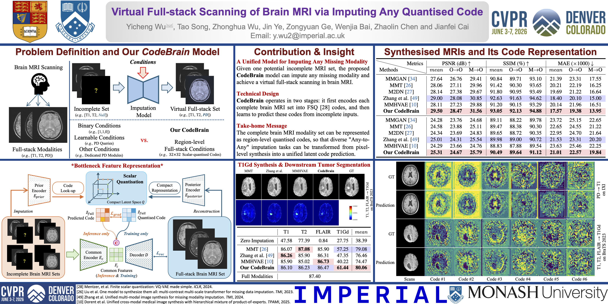

# Virtual Full-stack Scanning of Brain MRI via Imputing Any Quantised Code
by Yicheng Wu*+, Tao Song+, Zhonghua Wu, Jin Ye, Zongyuan Ge, Wenjia Bai, Zhaolin Chen, and Jianfei Cai.

### News
```
<19.05.2026> Posters and videos are available;
```
```
<20.03.2026> We released the codes;
```
```
<21.02.2026> The paper is accepted by CVPR 2026;
```
### Introduction



This repository is for our paper: "[Virtual Full-stack Scanning of Brain MRI via Imputing Any Quantised Code](https://arxiv.org/pdf/2501.18328)", the video introduction can be found at [YouTube](https://www.youtube.com/watch?v=oHKOVApCouk&t=3s) platform.

This work aims to generate virtual full-stack brain MRI scans from any incomplete input. Here, the complete brain MRI modality set can be represented as region-level quantised codes, so that diverse "Any-to-Any" imputation tasks can be transformed from pixel-level synthesis into a unified latent code prediction.

### Requirements
All experiments in our paper were conducted on eight NVIDIA GeForce 4090 GPUs. This repository is based on PyTorch 2.9.1+cu128 and Python 3.12.12. We further validate this repository via a single NVIDIA GeForce 5090 GPU. The performance is slightly higher than the reported ones. Check ./CodeBrain/models/ for more details.

### Usage
1. Clone this repo.;
```
git clone https://github.com/ycwu1997/CodeBrain.git
```
2. Put the 2D slices into "./MRI/";
3. Training;
```
cd ./CodeBrain
# for the two-stage training
sh train.sh
```
4. Testing;
```
cd ./code
# for the imputation inference
python evaluate_grad.py
```

### Citation
If our CodeBrain model is useful for your research, please consider citing:

    @InProceedings{wu2026codebrain,
        author    = {Wu, Yicheng and Song, Tao and Wu, Zhonghua and Ye, Jin and Ge, Zongyuan and Bai, Wenjia and Chen, Zhaolin and Cai, Jianfei},
        title     = {Virtual Full-stack Scanning of Brain MRI via Imputing Any Quantised Code},
        booktitle = {Proceedings of the IEEE/CVF Conference on Computer Vision and Pattern Recognition (CVPR)},
        year      = {2026}
    }

### Acknowledgments:
Our code is adapted from [NAFNet](https://github.com/megvii-research/NAFNet), [vector-quantize-pytorch](https://codeberg.org/lucidrains/vector-quantize-pytorch), [CodeFormer](https://github.com/sczhou/codeformer), [MMGAN](https://github.com/trane293/mm-gan), and [PyTorch_GAN](https://github.com/eriklindernoren/PyTorch-GAN). Thanks to these authors for their valuable works, and hope our model can promote the relevant research as well.

### Questions
If any questions, feel free to contact me at 'ycwueli@gmail.com'
